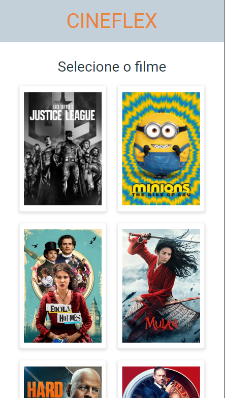

# Cineflex

Cineflex é uma aplicação web para realizar reservas de poltronas em salas de cinema.



Você pode acessar o projeto em deploy [aqui](https://cineflex-five-ivory.vercel.app/).

## Sobre

Cineflex é um gerenciador de reservas de poltronas em salas de cinema, onde há diversos filmes e salas para sua escolha.

Aqui você pode:

    - Acessar os filmes que estão em cartaz.
    - Selecionar um dos horários disponíveis.
    - Selecionar uma ou mais poltronas que deseja reservar.
    - Digitar o nome e o CPF do comprador.
    - Em seguida irá aparecer uma tela com a mensagem de sucesso.

O cineflex foi criado com o intuíto de ser proptótipo de projetos de reservas semelhante, porém, mais robustos.

## Tecnologias utilizadas

<div style="display: flex; gap: 5px; align-items: center; justify-content: space-evenly; width: 100vw">
    
    
    
    
    
</div>

## Como utilizar em desenvolvimento

- ATENÇÂO. Cineflex utiliza uma API externa.

1. Clone o repositório
2. Abra a pasta gerada `Cineflex`
3. Instale todas as dependências
```bash
    npm install
```
4. Para rodar localmente utilize
```bash
    npm start
```
5. Para construir a aplicação utilize
```bash
    npm run build
```